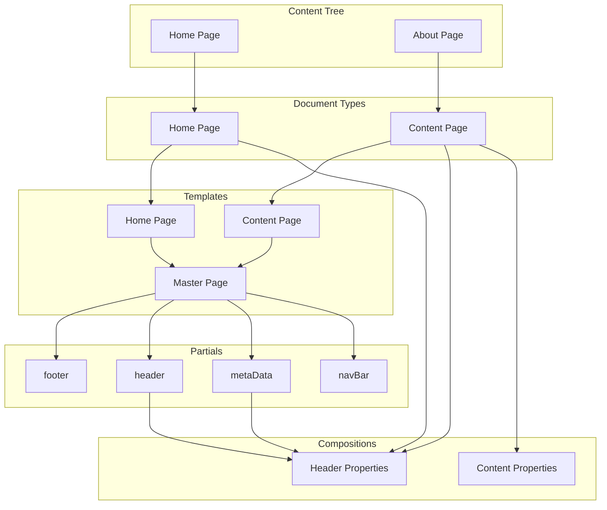

- Templates exist as both files and are registered in the database
- Partial templates only exist as files, not in the database

When making master templates need to be aware of @using specific composition models:

Razor snippet for pulling in partials:
    `@await Html.PartialAsync("~/Views/Partials/NameOfPartial.cshtml")`

.css and .js need leading / added to help deal with different file paths:

`<link href="/css/styles.css" rel="stylesheet"/>`
``

### Overview of Umbraco 10 site - v1
Flowchart of site after Paul Seal's "How to build a website with Umbraco 10 - Part 4 - Slicing the Templates"

