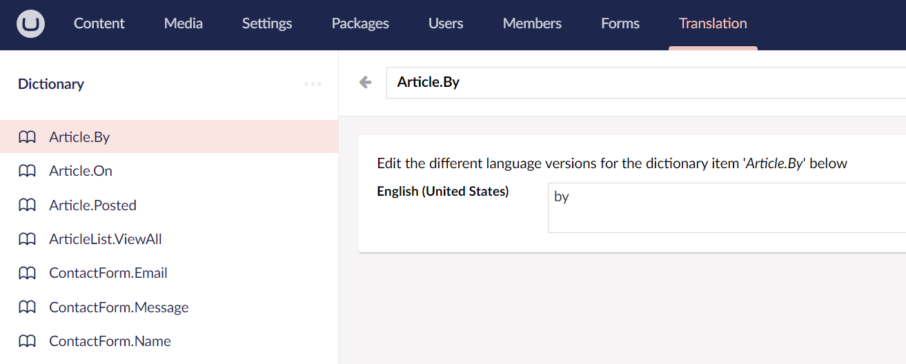
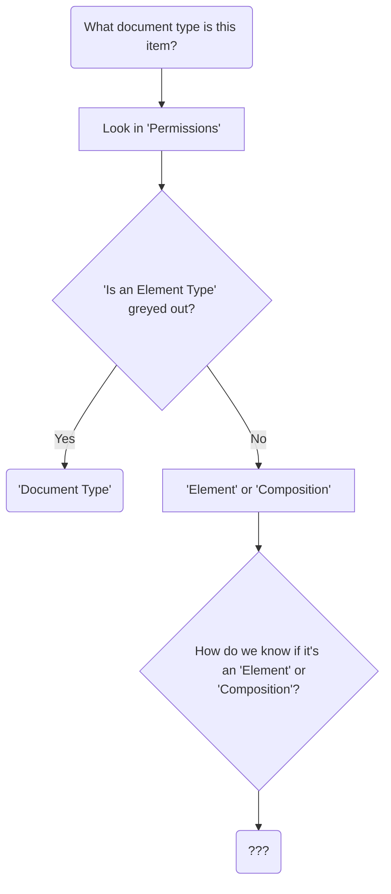
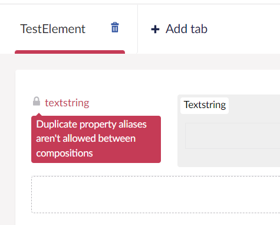

## Translation section

- Put any string values which are English-specific here:

These are then referenced in code as:

` @Umbraco.GetDictionaryValue("Article.By") `

# FAQs

## Can I change the URL of the Umbraco admin page from `/umbraco`?

No 

- see [GitHub issue](https://github.com/umbraco/Umbraco-CMS/issues/12593) which led to `/umbraco` being set to unchangable

- see Seb's answer from [Discord](https://discord.com/channels/869656431308189746/1122824272319090789/1122829680605663293):

> As an explanation of this (also related to the original issue and discussion here: https://github.com/umbraco/Umbraco-CMS/issues/12593):
>
> Over the years, we have had many issues reported with plugins not working because the URL of the backoffice was renamed. This could be overcome by extra care and attention from plugin developers, but it's been a struggle as those developers don't know to expect the name change.
>
>The breaking point for us (as Umbraco HQ) came when we wanted to move towards using Razor Class Libraries (RCLs) for the backoffice assets. RCLs provide a much more robust way of installing and deploying NuGet packages that contain static assets, making the developer experience better. The trade-off here: we can't rename the directory from Umbraco to something else. 
>
>Additionally, the same plugin developers that already knew to look for sites changing the /umbraco URL were for the same reason unable to use RCLs for their packages, for the exact same reason, the umbraco path has to be consistent for this to work.
>
>Unfortunately, we didn't see a way out of this and we weighed reliable installs and deploys against the obscuring of the Umbraco path. Realizing that there are very robust ways to protect the backoffice, even if it is on a predictable path, was the biggest factor in deciding to lean towards a better install/deploy experience vs the relatively small amount of people wanting to customize the backoffice URL.

## When I upload a file in Umbraco, where does it go?

`/wwwroot/media`

## How do I know if a document type is a Document Type, Element Type or Composition

### Document Type

- Check "Permissions"

- If "Is an Element Type" is greyed out then it's a *Document Type*

################

## Can I have the same alias between two compositions?

No:

